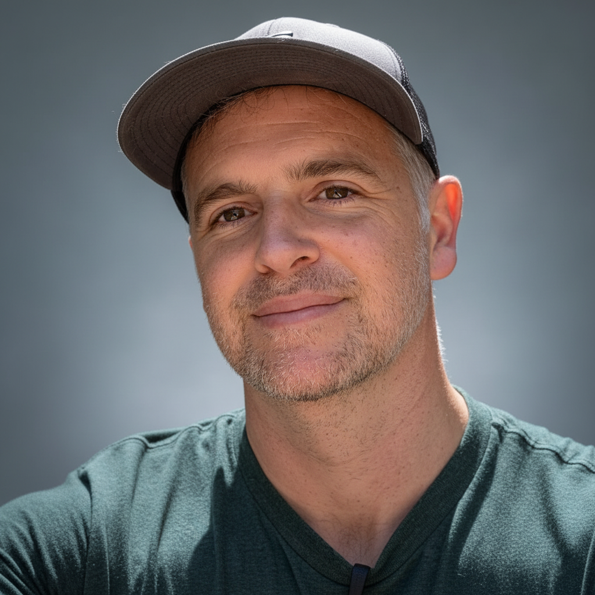
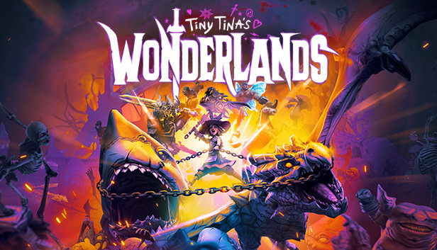

<header class="site-header" role="banner">
  

    
    <nav class="site-nav">
      

        <a class="page-link" href="#experience">Experience</a>
        <a class="page-link" href="#games">Games</a>
        <a class="page-link" href="#expertise">Expertise</a>
        <a class="page-link" href="#contact">Contact</a>
      

    </nav>
  

</header>

  

    

      <h1>Andrew J Webster</h1>
      <h2>Game Production Portfolio</h2>
      
20+ years leading teams, shipping AAA titles, and building the processes that make studios successful.

      
      

        <a href="#experience" class="btn btn-primary">View Experience</a>
        <a href="#contact" class="btn btn-secondary">Get In Touch</a>
      

    

    
    

      
    

  

<section id="overview" class="section">
  

    <h2>Who I Am</h2>
    

      

        
I'm a seasoned production leader who specializes in taking complex, ambiguous challenges and turning them into successful, predictable outcomes. My career spans from QA testing at Rockstar Games to leading 250+ person teams at Amazon Games.

        
        
What sets me apart is my ability to build durable systems and processes that prevent problems from happening again. I don't just put out fires—I architect solutions that make teams more effective, projects more predictable, and studios more successful.

      

      
      

        

          250+
          Team Members Led
        

        

          15+
          AAA Titles Shipped
        

        

          $30M+
          Budget Managed
        

        

          20+
          Years Experience
        

      

    

  

</section>

<section id="current-role" class="section section-alt">
  

    <h2>What I'm Doing Now</h2>
    

      

        <h3>Production Director, Development</h3>
        <h4>Amazon Games Studio</h4>
        
November 2024 - Present

        
        

          <h5>Recent Accomplishments:</h5>
          <ul>
            <li>Created and launched the "Incubation Teams" program—a new framework for rapid prototyping that's now used by 50+ developers</li>
            <li>Manage $30M operational budget for New World while driving outsourcing spend to stay within $3M target</li>
            <li>Reduced manual processes by 98% through AI automation, transforming hour-long tasks into minutes</li>
            <li>Lead and mentor a cross-functional team of 15 producers and release managers</li>
          </ul>
        

      

      
      

        
        
Leading production for New World, Amazon's flagship MMO

        

          <a href="https://www.newworld.com/en-us/#ags-MediaPopup" target="_blank" class="btn btn-secondary">
            🎬 Watch New World Trailer
          </a>
        

      

    

  

</section>

<section id="experience" class="section">
  

    <h2>My Journey</h2>
    

      

        

        

          <h3>Production Director, Development</h3>
          <h4>Amazon Games Studio</h4>
          2024 - Present
          
Leading strategic initiatives and managing New World's console operations. Created the Incubation Teams program and championed AI-driven production efficiency.

        

      

      
      

        

        

          <h3>Senior Producer, Development</h3>
          <h4>Amazon Games Studio</h4>
          2023 - 2024
          
Spearheaded New World's successful console launch, coordinating with Sony and Microsoft. Reduced deployment lag by 50% through process optimization.

        

      

      
      

        

        

          <h3>Executive Producer, Publishing</h3>
          <h4>2K Games</h4>
          2019 - 2023
          
Managed the billion-dollar Borderlands franchise and launched Marvel's Midnight Suns. Led a team of 16 producers across a 10+ title portfolio.

        

      

      
      

        

        

          <h3>Producer / Associate Producer</h3>
          <h4>2K Games</h4>
          2012 - 2018
          
Led Borderlands franchise development and managed multiple AAA projects including Mafia III and WWE 2K series.

        

      

      
      

        

        

          <h3>QA Supervisor / Lead Tester</h3>
          <h4>2K Games / Rockstar Games</h4>
          2003 - 2012
          
Started career in QA, progressing to lead tester on GTA and Mafia series. Built foundation in quality processes and team leadership.

        

      

    

  

</section>

<section id="games" class="section section-alt">
  

    <h2>Games I've Shipped</h2>
    

      <a href="https://www.newworld.com/en-us/" target="_blank" class="game-card-link">
        

          
          

            <h4>New World</h4>
            
Amazon Games

            Production Director
          

        

      </a>
      
      <a href="https://midnightsuns.2k.com/" target="_blank" class="game-card-link">
        

          
          

            <h4>Marvel's Midnight Suns</h4>
            
2K Games

            Executive Producer
          

        

      </a>
      
      <a href="https://wonderlands.2k.com/" target="_blank" class="game-card-link">
        

          
          

            <h4>Tiny Tina's Wonderlands</h4>
            
2K Games

            Executive Producer
          

        

      </a>
      
      <a href="https://borderlands.2k.com/" target="_blank" class="game-card-link">
        

          
          

            <h4>Borderlands 3</h4>
            
2K Games

            Executive Producer
          

        

      </a>
      
      <a href="https://www.2k.com/en-US/game/evolve/" target="_blank" class="game-card-link">
        

          
          

            <h4>Evolve</h4>
            
2K Games

            Producer
          

        

      </a>
    

  

</section>

<section id="expertise" class="section">
  

    <h2>What I Do Best</h2>
    

      

        
🎯

        <h3>Strategic Problem Solving</h3>
        
I take complex, ambiguous challenges and architect durable solutions. I don't just solve today's problem—I build systems that prevent tomorrow's problems.

      

      
      

        
👥

        <h3>Team Leadership</h3>
        
I've led teams from 15 to 250+ people, building high-performing cultures through transparency, empowerment, and continuous growth.

      

      
      

        
⚙️

        <h3>Process Architecture</h3>
        
I create scalable frameworks that improve predictability and quality. My "Weather Map" reporting system is now used across multiple studios.

      

      
      

        
🤖

        <h3>AI Innovation</h3>
        
I champion AI as a force multiplier for production teams, reducing manual work by 98% and freeing teams to focus on strategic challenges.

      

    

  

</section>

<section id="contact" class="section section-alt">
  

    <h2>Let's Connect</h2>
    

      

        
I'm always interested in discussing new opportunities, sharing insights about game production, or exploring how we might work together.

        
        

          <a href="mailto:AndrewJWebster1981@gmail.com" class="contact-method">
            📧
            AndrewJWebster1981@gmail.com
          </a>
          
          <a href="tel:628-238-9372" class="contact-method">
            📞
            628-238-9372
          </a>
          
          <a href="https://www.linkedin.com/in/andrew-webster-68577b13/" class="contact-method" target="_blank">
            💼
            LinkedIn Profile
          </a>
        

      

      
      

        <h3>Ready to work together?</h3>
        
View my resume to learn more about my experience and approach.

        
        

          <a href="/Career/resume" class="btn btn-primary">View Resume</a>
        

      

    

  

</section>